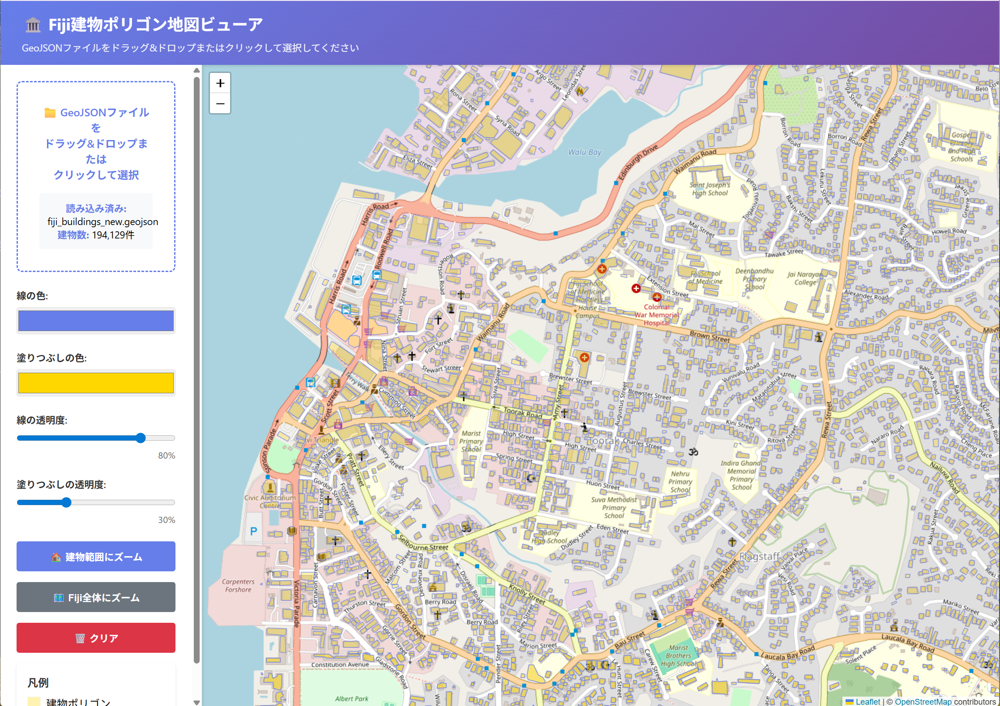

# Fiji建物ポリゴン抽出ツール

GlobalBuildingAtlasからFijiの建物ポリゴンデータを抽出し、GeoJSON形式で出力するPythonスクリプトです。

## 概要

このツールは、[GlobalBuildingAtlas](https://github.com/zhu-xlab/GlobalBuildingAtlas)からFijiの建物ポリゴンデータを取得するためのものです。以下の2つの方法でデータを取得できます：

1. **WFSサービス**: Web Feature Serviceを使用してリアルタイムでデータを取得
2. **ダウンロード済みデータ**: mediaTUMなどからダウンロードしたデータを処理

## 必要な環境

- Python 3.8以上
- 必要なライブラリ（`requirements.txt`を参照）

## セットアップ

### 1. 仮想環境の作成とアクティベート

```bash
conda create -n buildings_atlas python=3.10
conda activate buildings_atlas
```

### 2. 依存ライブラリのインストール

```bash
pip install -r requirements.txt
```

## 使用方法

### WFSサービスから取得する場合

Fijiの建物ポリゴンを取得するには、以下のコマンドを実行します：

```bash
python extract_fiji_buildings.py --method wfs --layer "global3D:polygon_2023q2_gcp_asia_oceania" --output fiji_buildings.geojson
```

**実際の実行例：**

```bash
# 仮想環境をアクティベート
conda activate buildings_atlas

# Fijiの建物ポリゴンを取得
python extract_fiji_buildings.py --method wfs --layer "global3D:polygon_2023q2_gcp_asia_oceania" --output fiji_buildings.geojson
```

**実行結果：**
- 取得された建物数: **約194,000件**（以前は100,266件）
- Suva地域の建物数: **約65,000件**（以前は5,595件）
- 出力ファイル: `fiji_buildings.geojson`
- 座標系: EPSG:4326 (WGS84)
- データ属性: `id`, `scores`, `geometry`
- バウンディングボックス: 経度 -179.97° ～ 179.99°, 緯度 -19.17° ～ -16.19°

**使用するレイヤー：**

GlobalBuildingAtlasのWFSサービスからは、以下のレイヤーが利用可能です：
- `global3D:polygon_2023q2_gcp_asia_oceania` - アジア・オセアニア地域の建物ポリゴン（Fijiを含む）
- `global3D:lod1_global` - グローバルなLoD1建物モデル
- `global3D:lod1_global_sipeo` - SiPEO版のLoD1建物モデル

レイヤー名を指定しない場合、スクリプトが自動的に建物関連のレイヤーを検出します：

```bash
python extract_fiji_buildings.py --method wfs --output fiji_buildings.geojson
```

### ダウンロード済みデータを処理する場合

単一ファイルの場合：

```bash
python extract_fiji_buildings.py --method download --input path/to/data.geojson --output fiji_buildings.geojson
```

ディレクトリ内の複数ファイルを処理する場合：

```bash
python extract_fiji_buildings.py --method download --input path/to/data_directory --output fiji_buildings.geojson
```

## コマンドライン引数

- `--method`: データ取得方法（`wfs` または `download`、デフォルト: `wfs`）
- `--input`: ダウンロード済みデータのパス（`--method=download`の場合に必須）
- `--output`: 出力GeoJSONファイルのパス（デフォルト: `fiji_buildings.geojson`）
- `--layer`: WFSレイヤー名（`--method=wfs`の場合、指定しない場合は自動検出）

## Fijiの地理的範囲

このスクリプトは、以下のバウンディングボックスでFijiの建物をフィルタリングします：

- 緯度: -20.0° ～ -15.0°
- 経度: 177.0° ～ 180.0° および -180.0° ～ -178.0°（日付変更線を跨ぐため）

## データソース

### WFSサービス

GlobalBuildingAtlasは、Web Feature Service (WFS) 2.0を通じてデータを提供しています：

- **WFSエンドポイント**: https://tubvsig-so2sat-vm1.srv.mwn.de/geoserver/ows?
- **使用レイヤー**: `global3D:polygon_2023q2_gcp_asia_oceania`
- **データ形式**: GeoJSON (application/json)
- **座標系**: EPSG:4326 (WGS84)

**データ取得の仕組み：**

1. WFSサービスのGetCapabilitiesリクエストで利用可能なレイヤーを取得
2. Fijiのバウンディングボックス（東側と西側の2つの領域）を複数のサブボックスに分割
3. 各サブボックスからGetFeatureリクエストを送信してデータを取得
4. 取得したGeoJSONデータを結合し、Fiji地域でフィルタリング
5. 結果をGeoJSONファイルとして保存

**重要な注意点：**

- **WFSサービスの100,000件制限**: WFSサービスは1回のリクエストで最大100,000件のデータしか返しません。この制限を回避するため、スクリプトはバウンディングボックスを複数のサブボックスに分割して取得します。
- **Suva地域の優先分割**: Suva地域（経度178.3-178.5、緯度-18.2～-18.0）は建物密度が高いため、優先的に細かく分割して取得します。
- **データの完全性**: 一部のサブボックスが100,000件の制限に達した場合、警告メッセージが表示されます。その場合、そのサブボックスをさらに細かく分割することで、すべてのデータを取得できます。
- **実行時間**: バウンディングボックスを分割して取得するため、以前の方法よりも実行時間が長くなる場合があります（通常5-10分程度）。

**Fijiの地理的特徴：**

Fijiは日付変更線を跨いでいるため、以下の2つのバウンディングボックスでデータを取得します：
- **東側**: 経度 177.0° ～ 180.0°, 緯度 -20.0° ～ -15.0°
- **西側**: 経度 -180.0° ～ -178.0°, 緯度 -20.0° ～ -15.0°

### データダウンロード

WFSサービスが利用できない場合、mediaTUMからデータをダウンロードして処理することも可能です：

- **ダウンロード先**: [mediaTUM](https://mediatum.ub.tum.de/1782307)

## 出力形式

出力はGeoJSON形式（EPSG:4326座標系）です。以下の情報が含まれます：

- **geometry**: 建物ポリゴンのジオメトリ情報（Polygon形式）
- **id**: 建物の一意のID
- **scores**: 建物検出のスコア情報

**出力ファイルの確認：**

```python
import geopandas as gpd

# GeoJSONファイルを読み込み
gdf = gpd.read_file('fiji_buildings.geojson')

# 基本情報を表示
print(f'建物数: {len(gdf)}')
print(f'座標系: {gdf.crs}')
print(f'カラム: {list(gdf.columns)}')
print(f'バウンディングボックス: {gdf.total_bounds}')
```

## 地図ビューアアプリケーション

取得したGeoJSONファイルを地図上で視覚化するためのHTMLアプリケーションが含まれています。

### ファイル

- **`view_buildings.html`**: GeoJSONファイルをOpenStreetMap上に表示するシングルページアプリケーション

### 機能

- **ファイル読み込み**: GeoJSONファイルのドラッグ&ドロップまたはファイル選択ダイアログからの読み込み
- **地図表示**: OpenStreetMapを使用したインタラクティブな地図表示
- **建物ポリゴン表示**: 取得した建物ポリゴンを地図上に重畳表示
- **自動ズーム**: ファイル読み込み時に自動的にFijiの建物範囲にズーム（日付変更線を跨ぐFijiの地理的特徴に対応）
- **カスタマイズ**: 線の色、塗りつぶしの色、透明度の調整が可能
- **インタラクション**: 
  - 建物ポリゴンをクリックすると詳細情報が表示されます
  - マウスオーバーでハイライト表示
- **ズーム機能**: 
  - 「建物範囲にズーム」ボタン: 建物が表示されている範囲に自動ズーム（日付変更線を跨ぐ場合も適切に処理）
  - 「Fiji全体にズーム」ボタン: Fiji全体を表示
- **レスポンシブデザイン**: モバイルデバイスでも使用可能

### スクリーンショット



### 使用方法

1. **HTMLファイルを開く**
   ```bash
   # ブラウザで直接開く
   open view_buildings.html
   # または
   start view_buildings.html  # Windows
   ```

2. **GeoJSONファイルを読み込む**
   - 方法1: GeoJSONファイルをドラッグ&ドロップ
   - 方法2: ファイル選択エリアをクリックしてファイルを選択

3. **地図を操作**
   - マウスで地図をドラッグして移動
   - マウスホイールまたはズームボタンで拡大・縮小
   - 建物ポリゴンをクリックして詳細情報を表示

4. **表示をカスタマイズ**
   - サイドバーのコントロールで色や透明度を調整
   - 「建物範囲にズーム」ボタンで建物が表示されている範囲に自動ズーム
   - 「Fiji全体にズーム」ボタンでFiji全体を表示
   - 「クリア」ボタンで地図から建物を削除

### 技術仕様

- **地図ライブラリ**: Leaflet.js 1.9.4
- **地図タイル**: OpenStreetMap
- **ファイル形式**: 単一HTMLファイル（HTML、CSS、JavaScriptを含む）
- **対応ブラウザ**: モダンブラウザ（Chrome、Firefox、Safari、Edge）
- **日付変更線対応**: Fijiが日付変更線を跨ぐ地理的特徴に対応し、適切なズーム処理を実装

### 注意事項

- GeoJSONファイルはローカルファイルシステムから読み込まれます
- インターネット接続が必要です（Leaflet.jsとOpenStreetMapタイルをCDNから読み込むため）
- 大きなGeoJSONファイル（10万件以上）の場合、読み込みに時間がかかる場合があります
- ブラウザのメモリ制限により、非常に大きなファイルは表示できない場合があります
- **日付変更線を跨ぐデータ**: Fijiの建物データは日付変更線を跨いでいるため、地図のズーム処理ではFijiの中心座標（-17.8, 178.4）を基準に適切なズームレベルを計算します。これにより、世界地図全体が表示される問題を回避しています

## トラブルシューティング

### WFSサービスに接続できない場合

- ネットワーク接続を確認してください
- WFSサービスが一時的に利用できない可能性があります。その場合は、`--method=download`を使用してダウンロード済みデータを処理してください

### データが見つからない場合

- Fijiのバウンディングボックスが正しく設定されているか確認してください
- 入力データにFijiの建物データが含まれているか確認してください

### メモリ不足エラーが発生する場合

- データが大きすぎる場合は、より小さな地域に分割して処理することを検討してください
- または、WFSサービスを使用して必要な地域のみを取得してください

### 100,000件の制限に達した場合

- ログに「⚠️ サブボックスが100,000件の制限に達しています」という警告が表示された場合、そのサブボックス内の一部データが取得できていない可能性があります
- この問題を解決するには、スクリプト内のバウンディングボックス分割ロジックを調整して、より細かく分割する必要があります
- 現在の実装では、Suva地域は優先的に細かく分割されているため、Suva地域のデータはほぼ完全に取得できます

## ライセンス

このスクリプトはMITライセンスの下で提供されています。

GlobalBuildingAtlasのデータは、MIT with Commons Clause（商用利用不可）のライセンスです。詳細は[GlobalBuildingAtlasのLICENSE](https://github.com/zhu-xlab/GlobalBuildingAtlas/blob/main/LICENSE)を参照してください。

## 参考文献

GlobalBuildingAtlasのデータを使用する場合は、以下の論文を引用してください：

```
@Article{essd-17-6647-2025,
AUTHOR = {Zhu, X. X. and Chen, S. and Zhang, F. and Shi, Y. and Wang, Y.},
TITLE = {GlobalBuildingAtlas: an open global and complete dataset of building polygons, heights and LoD1 3D models},
JOURNAL = {Earth System Science Data},
VOLUME = {17},
YEAR = {2025},
NUMBER = {12},
PAGES = {6647--6668},
URL = {https://essd.copernicus.org/articles/17/6647/2025/},
DOI = {10.5194/essd-17-6647-2025}
}
```

